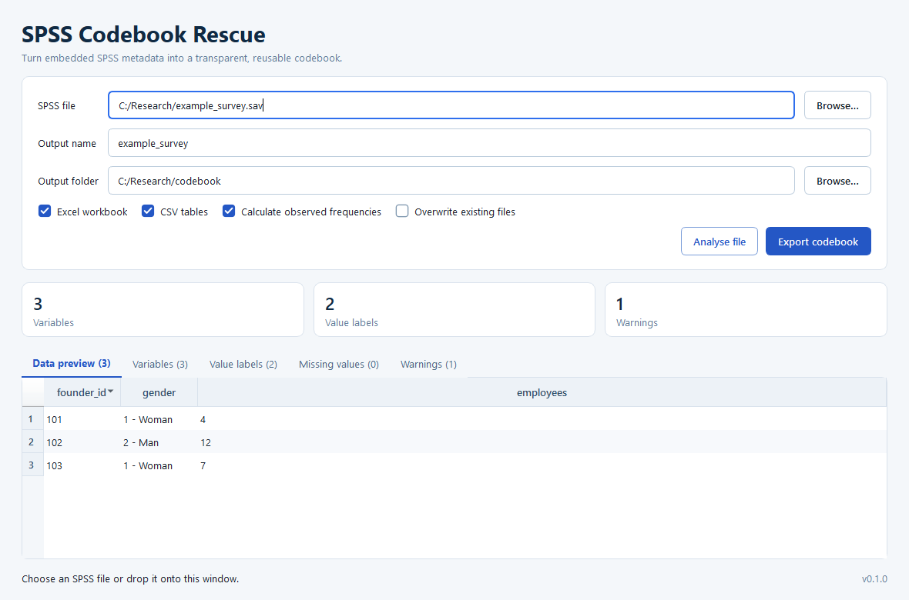

# SPSS Codebook Rescue

A small, local-first desktop app for turning the metadata embedded in SPSS
`.sav` and `.zsav` files into readable Excel and CSV codebooks.



## Why this exists

Every now and then, a project hands me an SPSS file to work with but I prefer to work in R. Those files often arrive with a patchy codebook, or no codebook at all, which turns even simple data work into an avoidable guessing game and a lot of back and forth.

So I built this little app: give it an SPSS file and it turns the metadata still
embedded in that file into a readable codebook. It does not magically restore
documentation that was never there, but it makes the most of what is available
and lets me get back to the actual analysis, using the tidy data format, a little faster.

All processing happens on your computer and the app does not upload anything.

## Highlights

- Reads SPSS `.sav` and compressed `.zsav` files.
- Extracts variable labels, value labels, formats, measurement levels, and
  user-defined missing values.
- Flags variables without labels and observed codes without value labels.
- Optionally calculates observed counts and percentages.
- Shows a labelled preview of the first 500 rows.
- Exports a formatted Excel workbook and/or analysis-friendly UTF-8 CSV files.
- Runs as a portable Windows app; Python and SPSS are not required.
- Includes a command-line interface for reproducible workflows.

## Quick start on Windows

1. Download `SPSS-Codebook-Rescue-Windows.zip` from the
   [latest release](https://github.com/drdiscipulus/spss-codebook-rescue/releases/latest).
2. Extract the ZIP file to a folder you can write to.
3. Open `SPSS Codebook Rescue.exe`.
4. Choose or drag in a `.sav` or `.zsav` file.
5. Review the extracted tables and select **Export codebook**.

The build is unsigned. Windows may show a Microsoft
Defender SmartScreen prompt even when the downloaded checksum matches the
release.

A macOS version is not planned.

## Generated files

For an output name such as `study`, the app can create:

| File | Contents |
| --- | --- |
| `study_codebook.xlsx` | All codebook tables in one formatted workbook |
| `study_variables.csv` | One row per variable |
| `study_value_labels.csv` | Value labels in long format |
| `study_missing_values.csv` | Discrete and range-based user-missing definitions |
| `study_warnings.csv` | Potential documentation gaps |

The Excel workbook contains `variables`, `value_labels`, `missing_values`, and
`warnings` sheets. Headers are filterable, the first row is frozen, and column
widths are adjusted automatically.

### Output schema

`variables`

```text
variable_name, variable_label, storage_type, spss_format, measure,
has_value_labels, n_observed, n_missing, n_distinct_observed
```

`value_labels`

```text
variable_name, variable_label, value, value_label, is_user_missing,
observed_count, observed_percent, source
```

`missing_values`

```text
variable_name, missing_type, value, lower, upper, label
```

`warnings`

```text
severity, variable_name, value, message
```

Raw SPSS codes are preserved. In `value_labels`, `observed_percent` is the share
among non-system-missing rows, including SPSS user-missing codes. In
`variables`, `n_observed` excludes both system-missing and user-missing values.

## Install from source

Python 3.12 is required.

```powershell
py -3.12 -m venv .venv
.\.venv\Scripts\Activate.ps1
python -m pip install -e ".[dev]"
```

Start the desktop app:

```powershell
spss-codebook-rescue-gui
```

Or generate a codebook from the command line:

```powershell
spss-codebook-rescue survey.sav --output-dir . --output-name survey
```

Useful CLI options include `--no-excel`, `--no-csv`, `--no-frequencies`,
`--overwrite`, and `--preview-rows`.

## Development

The code follows a small, explicit pipeline:

```text
SPSS file -> metadata extraction -> normalized pandas tables -> GUI / CLI -> Excel / CSV
```

- `src/spss_codebook/core.py` contains SPSS extraction and normalization.
- `src/spss_codebook/exporters.py` owns all output formatting and file naming.
- `src/spss_codebook/workflow.py` exposes the shared GUI/CLI workflow.
- `src/spss_codebook/gui.py` contains the Qt desktop interface.
- `tests/` uses synthetic SPSS fixtures; no private research data is required.

Run the quality checks with:

```powershell
python -m ruff check .
python -m pytest -q
```

## Build a portable Windows app

```powershell
.\scripts\build_windows.ps1
```

The script runs linting and tests before creating:

- `dist/SPSS-Codebook-Rescue-Windows.zip`
- `dist/SPSS-Codebook-Rescue-Windows.zip.sha256`

The ZIP file and its checksum can then be attached to a GitHub release manually.

## Current limitations

- Multiple-response sets and some advanced SPSS metadata are not extracted yet.
- Frequency calculation reads the complete dataset and can take time for large
  files.
- The data preview is intentionally limited to 500 rows.

## Project status

This is a personal side project that I built in my spare time. I maintain it
when time allows, so updates will likely be sporadic.

## License and attribution

SPSS Codebook Rescue is free and open-source software licensed under the
[GNU General Public License version 3](LICENSE), specifically `GPL-3.0-only`.

SPSS is a trademark of IBM. This independent project is not affiliated with or
endorsed by IBM.
